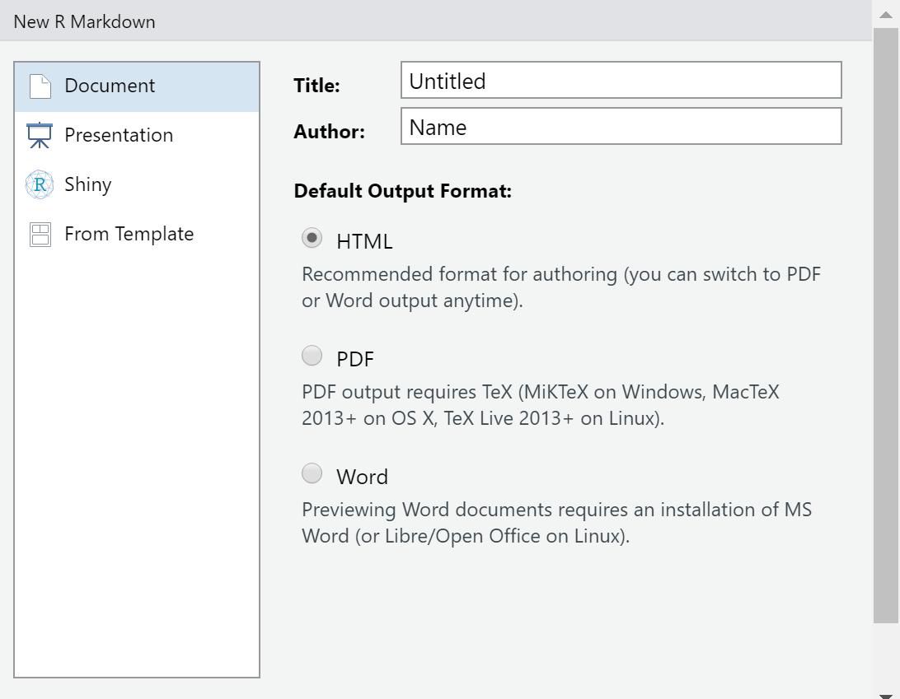
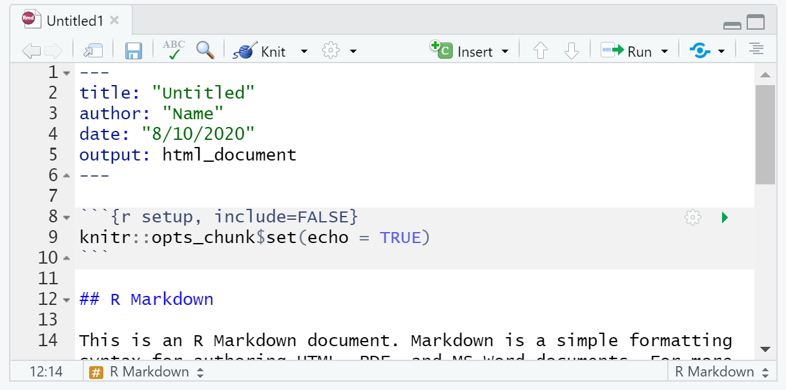
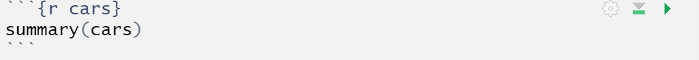
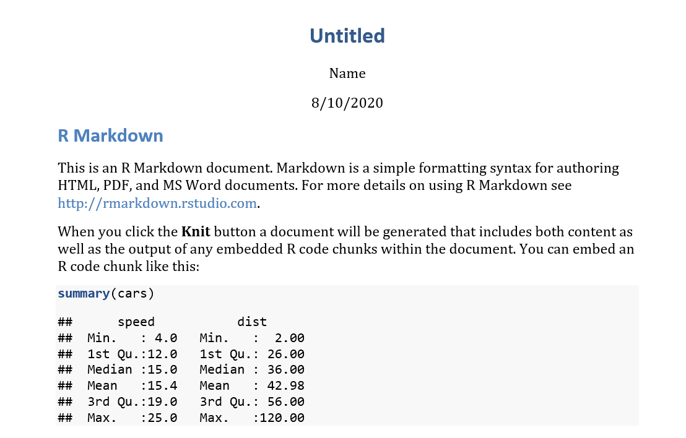

```{r setup, include=FALSE}
library(learnr)
knitr::opts_chunk$set(echo = FALSE)
```

## What is R Markdown?

In RStudio, when you go to create a new file there are numerous options. If you are just interested in storing your code, then you might select "R Script." However, if you are interested in creating a report that shows your code, as well as your output (including data visualizations), then R Markdown might be the option for you! R Markdown allows you to "knit" (i.e., compile) your file into a Word, pdf, or html document. This tutorial covers the basics of Markdown. ([This](https://vimeo.com/178485416) video also provides a good overview of Markdown.)

## Getting Started in Markdown

You've decided to create a Markdown file and click the R Markdown option. The next thing you need to do is to customize it for your particular needs. First, on the left of the window that pops up you will see four options for your Markdown file: "Document," "Presentation," "Shiny," or "From Template." 

{width=75%}

If you would like to use Markdown to make a Word document, pdf, or html page, then the document option is for you. R recommends that you select the html option; you can switch to Word or pdf whenever you want!

You can also use Markdown to make a presentation in html, PowerPoint, or as a pdf. (To make a PowerPoint, you need to have that program installed on your computer, while the pdf option requires LaTex.) If you want to make a web app, then the Shiny option is for you. Finally, the "From Template" option allows you to select from a variety of existing designs to use Markdown to make everything from lab reports to tutorials. In fact, this tutorial was made using the Tutorial Option!

## R Markdown Header

Let's say you decided to create a document. Your R Markdown document will look like this when you first create it:

{width=75%}

You will notice that at the very top, there is a header with several lines of code, with three dashes above it and three dashes below. Depending on what type of Markdown file you select, these lines may include the title, the author name, the date, and the output (among other things).

You should give your Markdown file a unique title that applies to your particular project. The output tells R what kind of output you would like to make (e.g., a Word document or a pdf). You can change this if you would like and even if it says html, it's possible to override it to knit to Word or pdf even without changing the header. You won't always have a runtime line, but you can use it use Shiny to make a web app.

In a default new R Markdown file I created for the above image, these are the four lines at the top of my header:
```
---
title: "Untitled"
author: "Name"
date: "8/10/2020"
output: html_document
---
```
## Working in Markdown

Now you've created a new Markdown file and are ready to get started. The first thing to know about using Markdown is the importance of chunks. An R Markdown Chunk is a section you embed in your code that allows you to run R code. Here is an example of what a chunk looks like:



To insert an R Chunk, go to the insert button at the top center right above your Markdown file and click Insert and then the R option. Once you do this, you will notice that R has added a gray section to your file that begins with`` ```{r}`` and ends with `` ``` ``. Anything you type between this can be executed in R to run a model, make a graphic, or anything else you can do in R. 

While initially, you may just have the letter r inside the brackets, there are other things you can type here depending on what you want the chunk to do. First, after the letter r, you can give the chunk a name by just typing it. Be careful with this though; you have to give each chunk in your document a unique name in order for it to run.

You may notice at the top right of the chunk above that there is a wheel, a downward facing arrow, and a right facing arrow. The wheel allows you to specify what you would like your output to look like; for example, you may want R to include both your code and your output in the file you create in Markdown, but you might only want to include the output. By using this menu, you can customize for your needs for that chunk. For more detail, this [link](https://yihui.org/knitr/options/) discusses all the options you have inside R chunks.

Finally, the two arrows at the top of the Markdown file allow you to run chunks: the downward facing one runs the code in all chunks up to that point, while the rightward facing one runs only the code in that chunk. This does not execute anything run outside chunks. 

## Practice with R Chunks
One option for R Chunks is to show both your code and your output. Below is an example of how you can make a basic histogram in R and include code in your document so that whomever else looks at it knows how you created it. This data is available to you separately and you should change the file path so that you can load it into R on your computer if you want to replicate the below visualizations.

This is a histogram of the percentage of the vote Justin Trudeau's Liberal Party received in each province and territory in the 2019 Canadian election. Notice that first I called the readxl package for this session and then I made the historgram. While sometimes you might just want to include the plot in your output, having the option to include the code is something you may also want to do (or be asked to do).

```{r histograms, echo=TRUE, fig.width=5}
library(readxl)
Canada <- read_excel("Canada.xlsx")
library(ggplot2)
ggplot(Canada, aes(x=Percentage)) + 
  geom_histogram(binwidth=5) + labs(x="Percent of Vote", y="Percentage of Vote")
```

## A Few Other Things in Markdown
In addition to using Markdown to make plots and show the code that you used, there are other things you can do in Markdown.

Outside of each chunk, if you type text, it will appear in your final report. To denote when you are moving from one section (text+ any R Chunk related to that text) to another, you should making a heading for that section. To make a heading, you use the # symbol. If you want it to be a large heading, use only one or two #. If you want to make a subheading, use more of them. By creating a heading, you are creating a section of text + any R chunk code or plots.

Let's say that you want to show your reader what some code would look like, but don't want to actually execute it with a chunk. You can use three back quotes (i.e., ```) before an after a area of text to create a gray box similar to that which displays the text of a chunk. 

For example: ``` 4+4 equals 8 ``` was created by typing `` ``` 4+4 equals 8 ``` ``.

Another thing you can do in the text of a R Markdown file is create a table. Below is the code I used to create a table and the output when I put the code inside my Markdown file.

```
Column 1 | Column 2
-------- | --------
Cell 1   | Cell 2
Cell 3   | Cell 4 
```
Column 1 | Column 2
-------- | --------
Cell 1   | Cell 2
Cell 3   | Cell 4

In Markdown, if you would like your text to be in italics or bold, you should (respectively) put one or two asterisks both before and after the section you want to appear that way. The below table demonstrates what you should type in Markdown and how it then appears.

| Markdown format | Output    |
|-----------------|-----------|
| `*italics*`     | *italics* |
| `**bold**`      | **bold**  |

Finally, f you want to include a hyperlink in your Markdown file, do it by putting the word you want to have the link in brackets [] and the website in (). For example, if I wanted to link to the RStudio website, I would do it like this
```[This](https://rstudio.com/)``` 
[This](https://rstudio.com) is what that code creates outside of the three back quotes I used to show the example.

There are many other things that you can do in Markdown beyond these those discussed here; a helpful cheat sheet is available [here](https://rstudio.com/wp-content/uploads/2015/02/RMarkdown-cheatsheet.pdf). 

## Knitting Your Work When You're Finished

Once you have finished working in your Markdown file, you can turn it into the final product (e.g., a Word file or an html page) by "knitting" it. In other words, to turn it into the document you will share with others.

To knit a regular Markdown file, you can click the downward facing arrow next to "Knit" on the menu just above your Markdown file. Notice that here you can knit to an html file, but also have the option to select a Word file or pdf, even if you started with the html output option in your header. Please note that objects that are in your Console but not the Markdown file will not be knitted. 

A final note on knitting: sometimes your file won't be able to knit. If there is an issue with your code in one (or more) of the chunks, then R won't be able to knit the Markdown file. Helpfully, R will tell you where the first error in the document occurred should there be an issue. If your Markdown file still won't knit, another thing to double check is to make sure that you haven't given two chunks the same name.

If you knit to a Word file, your output will look something like this:
{width=75%}

## Quick Practice Quiz

Here are several questions to help review the material in this tutorial:

```{r quiz}
quiz(
  question("So far, I have R Chunks named cats, dogs, and fish in my Markdown file. Which of these is an acceptable name for my fourth chunk?",
    answer("cats"),
    answer("dogs"),
    answer("hamsters", correct = TRUE),
    answer("fish"),
    allow_retry = TRUE
  ),
  question("Which of these tells R that you are making a heading for a section of a Markdown file",
    answer("Name="),
    answer("Header:"),
    answer("#", correct=TRUE),
    answer("~"),
    allow_retry = TRUE
  )
)
```

