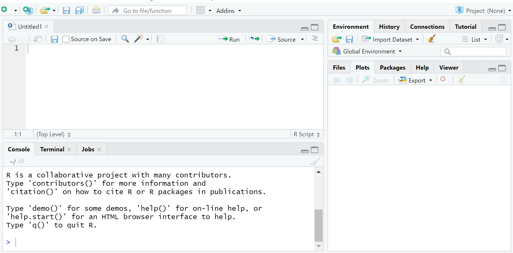

```{r setup, include=FALSE}
library(learnr)
knitr::opts_chunk$set(echo = FALSE)
```

## Summary
Welcome to learning R! This guide provides a basic overview of R and RStudio as you begin taking classes in the Duke Statistical Science Department. The skills you learn here may translate to other classes or experiences after you leave Duke. In this tutorial, we'll go over how to load R and RStudio on your computer and some basic functions you might use.

## What is R?
First things first, before we get started talking about things you can do in R, what is it and what is RStudio?

R is an open-source programming language that can be used for statistical computing. Because it's free, you can use it after you leave Duke.

RStudio is an integrated development environment for R. Basically, it makes it easier to work within the R environment.  

## Loading R and RStudio on Your Computer
In some of your classes you might be using a Docker container or the RStudio Cloud, but others might ask you to download R for your computer. 

If your class is using a Docker container, you can access them [here](https://vm-manage.oit.duke.edu/containers/rstudio). If your class is using R on the R Studio Cloud, you can access it [here](https://rstudio.cloud/).

You might also be asked to download R to use in class or you might just want to have it on your computer. You can download R [here](https://cran.r-project.org/mirrors.html). That link will take you to a list of CRAN-- that is, Comprehensive R Archive Network-- mirrors. You will want to download R from the nearest mirror. If you are in Durham, there's a mirror right here at Duke, but there are also mirrors all over the world if you aren't on campus right now. 

Once you have R on your computer, it's yours for free. You should know that R is always being updated, so you'll want to download a new version from time to time to stay current if you plan to keep using it.

Now that you've downloaded R, the next step is to download RStudio. This is also free! You can get it [here](https://rstudio.com/products/rstudio/download/). There are two options for downloading RStudio. RStudio Desktop will run right on your computer, while RStudio Server runs remotely. You would access RStudio Server on a web browser.

## The RStudio Interface: Getting Started
Here is what you should see when you first open R:

```{r echo = F, out.width = '75%'}
knitr::include_graphics("images/RInitial.png")
```

As pictured above, R has an interface that has a console on the left side of your screen and several other windows on the right side of your screen. 

To get started the first thing you will want to do is create a new savable file, which will often be a R Script or a R Markdown file depending on what your instructor wants you to do for that particular assignment. If you type a command into the console, you can carry it out, but you won't be able to save it for future use, so it's good to have a savable file to allow for replication of your code.

To do that, click on the plus symbol over the document on the far upper left of your screen. This will allow you to create a new R Script or R Markdown file (among other options). Creating a savable file like this will allow you to save your code so that you or someone else can run it again in the future.

This is what R will look like now:

```{r echo = F, out.width = "75%"}

```

Finally, you will see a bunch of windows on the top right side of your screen. These include an environment window, which will list things like data sets you load into R and a window showing the history of the code you have used. 

On the bottom right, you will see more windows, which include a list of files that have been loaded into R, and a window that will display plots that you make in RStudio.

## Basic Functions in R
There are a lot of things you can do in R, but if you want to, you can use it as a basic calculator. Below are some examples of basic arithmetic in R. You can also type an inequality (or equality) into R and it will tell you if it is correct. 

To have R execute these commands, you will click the "Run" command at the top of your R Script (or RMarkdown file; you will learn more about Markdown in another tutorial). If you want to run all of your commands, hit run; if you just want to run some of them, highlight those lines and then hit run. You don't need to highlight text describing your code here-- just the actual lines of code you want to run.

Also, it's a great idea to make comments along the way; if you type # at the start of a line then R won't execute that line when you click run. Having lots of a comments makes it easier for someone else to understand how to replicate your analysis.

Here are some examples of basic math in R. Please note, if you want to check if two expressions are equal to each other use a double equals rather than a single equals sign.
```{r calculator, echo=TRUE}
# Some Basic Math
1 + 1
7 / 3
4^4
18 < 29
7 + 1 == 6 + 2
```

Now it's your turn! Try some basic math problems and see how R works as a calculator. 

Please recall the [order of operations](https://www.mathsisfun.com/operation-order-pemdas.html) and how that may affect your answer. For example, try calculating  4 + 7 / 10 ^ 2. What happens if you put parentheses around 4 + 7?
```{r basicfunction, exercise=TRUE}

```

## Variable Creation
In addition to using R as a calculator, you can also use it to construct variables for later use. Let's say that you wanted a variable named x to equal 7+8. You could ask R to store it. To construct a variable, type its name and then write ```<-``` before typing what you want it to equal.

Here's an example of how to make variables in R. Once you create a variable, you can use it later. If you type its name, R will tell you what it equals. You can also carry out mathematical operations like addition or multiplication with variables. You also can create new variables from existing ones-- just make sure to give them a new, unique name before using the back arrow (```<-```).

Here are some examples of creating and combining variables in R.

```{r saving-values, echo=TRUE}
# Creating Variables in R
x <- 7 + 8
x
y <- 5 / 7
z <- x + y
z
```

Now it's your turn! Try creating some variables and then carry out some basic operations. For example, try to create a variable called x that is equal to 27 and divide it by another called y that is equal to 3. 
```{r variables, exercise=TRUE}

```

## Installing and Loading Packages in R
One of the neat things about R and the fact that it is open-source is that there are tons of packages that people all over the world have created that allow you to do all sorts of cool things such as make plots and manipulate data. Packages are the fundamental units of reproducible R code. They include reusable R functions, the documentation that describes how to use them, and often sample data.

To install a package, you use the install.packages() command, where you put the name of the package in quotation marks. Once you have installed a package in R, you don't need to install it again for that version of R.

Each session that you plan to use a package, you should call it, by using the library() command, with the name of the package inside the parentheses (but no need to use quotation marks here). 

You should install the package in the console, but then load it every session from your R Script or R Markdown file.

You will learn about many different packages as you learn R, but one example of a package is the ggplot2() package, which allows you to make lots of cool graphics. Here is an example on how to install it and then load it.

```
install.packages("ggplot2")
library(ggplot2)

```

If you have a question about a package in R, you can type ? and then the package name. For example if you are interested in learning more about ggplot 2, you would type ```?ggplot```. If nothing comes up, you can then type two question marks and the package name. While information about ggplot comes up here, you would type ```??ggplot```. What would you type if you were interested in finding out more information about the foreign package?

## Loading Data into R
Often, you will need to load outside data into R. Depending on the form the data is in, there are various packages that will allow you to load it in. For example, the foreign package allows you to load in many types of data including CSV files, while data from Excel can be loaded using the readxl package. 

Once you have loaded the necessary package for importing data, you load the data file in by using its file path. You should name the data set so that you can specifically tell R you are using a variable from that dataset. 

Below is an example of how you might load an Excel file into R. Using ~ before the file path tells you to load data from the existing working directory.

```
library(readxl)

#Name Your Dataset, then use <- and then list its relative file path.
 
my_data<- read_excel("~/Data/mydata.xlsx")

```

If you run into an error here, it may be because your file is located in a different working directory. To find your current working directory, use the getwd() command and to change it, use setwd(). More information on working directories and loading data is available [here](https://excelquick.com/r-programming/importing-data-absolute-and-relative-file-paths-in-r/).

## Quiz

Here is a short quiz that covers some of the topics from this tutorial for some additional practice:

```{r quiz}
quiz(
  question("If you wanted to construct a variable named x that was equal to 5.5, how would you do it?",
    answer("``x >- 5``"),
    answer("``x <- 5``", correct = TRUE),
    answer("``x > 5``"),
    answer("``x : 5``"),
    allow_retry = TRUE
  ),
  question("If you have installed the foreign package on your computer, how would you load it for that session?",
    answer("foreign"),
    answer("install.packages(foreign)"),
    answer("library(foreign)", correct = TRUE),
    answer("findit(foreign)"),
    allow_retry = TRUE
  ),
  question("If you want to load a package, where should you type that command?",
    answer("The Console", correct = TRUE),
    answer("Your R Markdown File"),
    answer("Your R Script"),
    answer("The Environment"),
    allow_retry = TRUE
  ),
  question("True or False: you need to load a package each R session?",
    answer("True", correct = TRUE),
    answer("False"),
    allow_retry = TRUE
  )
)
```
