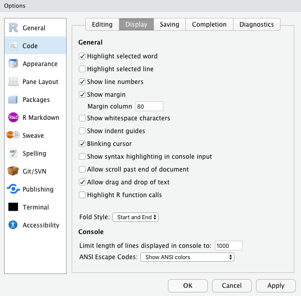

```{r setup, include=FALSE}
library(learnr)
library(knitr)
knitr::opts_chunk$set(error = TRUE, exercise.timelimit = 3)
```


## Introduction

---

### Learning objectives

- Create meaningful object and file names
- Use proper code grammar: spacing, line length, and quotes
- Function calls
- Utilize code comments

---

A coding style is similar to a writing style. Everyone has their own coding 
style, but as with writing and grammar rules, all good programmers abide by a 
set of rules and consistent practices to make their code functional and 
readable for others and their future self.

This tutorial will introduce you to some of the 
[tidyverse code style](https://style.tidyverse.org/) for R. Following these 
guidelines will allow you to focus more of your effort on writing quality code 
rather than thinking about what style or format to use in each situation. 
You'll still need to think of what to name your objects, but you won't need to 
think about how that object's name should be structured.

<div class = "warning">
**Warning!**: You'll see many different styles when you look at R code on
websites such as Stack Overflow. Always fix style inconsistencies when 
incorporating code you find from online into your work.
</div>

## Naming

### Object names

Object names should only consist of lowercase letters, numbers, and underscores.
The underscores can be used to separate multiple word names or a word and
numeric suffix. Always start your object's name with a word.

```{r eval=FALSE}
# Good
flights
flights_2020
flights_rdu
flights_gso

# Bad
FLIGHTS
2020_flights
FlightsRDU
_FlIgHtSGSO
```

Focus on choosing names that are short and informative. Object names are 
generally nouns, while function names are generally verbs.

Avoid choosing object names that are already functions or reserved words in R.
Failing to do so will make your code confusing as seen below.

```{r naming_problem_logical, exercise=TRUE}
F <- 1
T == F
```

<div class="info">
**Note!** In R, `T` and `F` are reserved words for the boolean values `TRUE` and 
`FALSE`. R also recognizes `TRUE` and `FALSE` in a capital letters.
</div>

If you try to overwrite some reserved words, R will throw an error.

```{r naming_problem_inf, exercise=TRUE, error=TRUE}
Inf <- 0
Inf
```

As you get more experienced with R, you'll learn which words are reserved and
which names are used as functions in commonly used packages. Avoid giving your
objects any of the following names:

- `NA`, `NaN`, `Inf`, `T`, `F`, `TRUE`, `FALSE`
- `for`, `if`, `while`, `in`, `function`
- `c`, `mean`, `median`, `sd`, `plot`

### File names

File naming follows many of the same rules as object naming. Keep your names
concise and meaningful.

```{r eval=FALSE}
# Good
homework_1.Rmd
hw_1.Rmd
nc_births_2020.csv

# Bad
HOMEWORK1.Rmd
NcBirths2020.csv
```

If you anticipate having a lot of files with a similar prefix and numeric 
suffix, consider beginning your file numbering at 01 rather than 1.

```{r eval=FALSE}
# Good
hw_01.Rmd
hw_02.Rmd
    ⋮
hw_09.Rmd
hw_10.Rmd

# Bad
hw_1.Rmd
hw_2.Rmd
    ⋮
hw_9.Rmd
hw_10.Rmd
```

There are times when you may want to have the file number as a prefix
rather than a suffix. Consider using the below format if your files should be 
run in a specific order within your R project. Again, use the two-digit 
numbering scheme.

```{r eval=FALSE}
# Good
01_scrape_data.R
02_clean_data.R
    ⋮
09_model.R
10_analyze_diagnostics.R

# Bad
scrape_data.R
clean_data.R 
    ⋮
model.R
analyze_diagnostics.R
```

<div class = "warning">
**Warning!** Never have file names that differ only in their capitalization.
</div>

## Syntax

### Assignment

Use `<-` and not `=` for assignment. We'll use `=` when we provide values
to arguments in functions. In an R code chunk, hitting keys `Alt` + `-` 
(`option` + `-`) will insert the assignment operator with appropriate spacing on
a Windows (Mac) computer.

```{r eval=FALSE}
# Good
x <- 1:10
mean(x = 1:10, na.rm = TRUE)
alpha <- 0.01

# Bad
x = 1:10
mean(x <- 1:10, na.rm <- TRUE)
alpha = 0.01
```

### Spacing

Put a single space on both sides of most infix operators and after every
comma. Infix operators are operators that expect values on the left and
right-hand sides of the operator, think `+`, `-`, `<-`, `=`, etc.

```{r eval=FALSE}
# Good
4 + 3 - (12 / 2)
sample(c(0, 1), size = 5, replace = TRUE)
x <- 10

# Bad
4+3-(12/2)
sample(c(0,1),size=5,replace=TRUE)
x<- 10
```

<div class = "warning">
**Warning!** This spacing rule does not apply to the infix operators `:`, `::`,
and `:::`.
</div>

### Line length

Keep your code and narrative within a width of 80 characters. Lines of code
can be broken after `,`, `%>%`, and `+` 
(when working with `tidyverse` functions).
For text narrative, simply hit `return` on your keyboard to start a new line
once you reach 80 characters.

In RStudio, go to the menu `Tools` > `Global Options` > `Code` > `Display`, and
check the box `Show Margin`. The `Margin column` should be set to 80. This
will place a vertical gray line in your R Markdown documents at a width of
80 characters.

<center>

</center>

### Quotes

To quote text, wrap it in a pair of `"` and not a pair of `'`.

```{r eval=FALSE}
# Good
c("Two", "too", "to")

# Bad
c('Two', 'too', 'to')
```

To see why using a pair of `'` is not advised, run the code below.

```{r single_quotes, exercise=TRUE, error=TRUE}
x <- 'I'm not a fan of single quotes'
x
```

The problem is with the contraction `I'm`. R thinks we are trying to quote `I`.
As a result, we then have a sequence of words that ends with a single `'` 
after the word `quotes`. This causes an error. Below is a better way to 
quote the sentence.

```{r double_quotes, exercise=TRUE, error=TRUE}
x <- "I'm not a fan of single quotes"
x
```

### Function calls

You'll be using functions a lot, from those available in R packages to ones you
write. Most functions perform some action(s) to some object(s). 
When using functions

- you can leave out the name of the data argument (generally this is first);
- write out the names of other arguments;
- do not write out the default arguments and their values unless you change the
  values.

```{r eval=FALSE}
# Good
mean(1:20)
ggplot(mtcars, mapping = aes(x = hp, y = mpg)) +
  geom_point()

# Bad
mean(1:20, trim = 0, na.rm = FALSE)
ggplot(data = mtcars, aes(x = hp, y = mpg)) +
  geom_point()
```

<div class = "warning">
**Warning!** In fitting a linear model, function `lm()` has the data argument
second. Always check the help (e.g., `?lm`) when working with a new function to 
understand its arguments.
</div>

### Comments

Comment your code to explain the why or non-obvious choices in your code. Code 
comments should not be used for analysis or interpretation of data, plots, 
model results, etc. A single `#` followed by a single space can be used in 
R chunks to provide code comments. R will ignore anything that follows on that 
line after the `#`.

```{r comments, exercise=TRUE, error=TRUE}
# R will ignore this,
# and this: 5 * 5,
# and this too, but not what is below

5 * 5
```

## Check your understanding

Below are some questions to check your understanding on code style.

```{r quiz, echo=FALSE}
quiz(
  question("A single space should preceed and follow every infix operator.",
    answer("True", 
           message = "There should not be a space before and after `:`."),
    answer("False", 
           correct = TRUE, 
           message = "There should not be a space before and after `:`."),
    random_answer_order = TRUE
  ),
  
  question("Choose the best object name for assigning the result of the mean
           number of hours worked per day",
    answer("mean", 
           message = "This is already the name of an R function."),
    answer("mhwpd",
           message = "The is not very readable or memorable"),
    answer("mean_hours",
           correct = TRUE,
           message = "This is the best option of the five."),
    answer("mean_hours_worked_per_day",
           message = "This is too long. Keep it short and memorable."),
    answer("MeanHours",
           message = "Avoid using camel case. Separate words with an 
                      underscore."),
    random_answer_order = TRUE,
    allow_retry = TRUE
  ),
  
  question("Both `<-` and `=` can be used for object assignment in R. However,
           `<-` is what should be used according to the tidyverse style guide.",
    answer("True",
           correct = TRUE,
           message = "Use `<-` for object assignment and `=` for providing
                      values to function parameters."),
    answer("False", 
           message = "Both `<-` and `=` can be used for object assignment in R.
                      You may see others use `=`, but this is not recommended."),
    random_answer_order = TRUE
  ),
  
  question("It is good practice to keep code and text narrative within 
            80 characters per line.",
    answer("True",
           correct = TRUE),
    answer("False",
           message = "Break long lines of code by hitting `return` at
                      appropriate places."),
    random_answer_order = TRUE
  ),
  
  question("Which special character allows you to provide comments inside an
            R code chunk?",
    answer("`@`",
           message = "This operator is used for subsetting."),
    answer("`$`",
           message = "This operator is used for subsetting."),
    answer("`!`",
           message = 'This is used for negation.'),
    answer("`&`",
           message = 'This is the logical operator for  "and".'),
    answer("`#`",
           correct = TRUE,
           message = "A single `#` is all that is needed to add a code comment."),
    random_answer_order = TRUE,
    allow_retry = TRUE
  )
)
```

## References

1. Style guide · R packages. (2020). Retrieved from
   http://r-pkgs.had.co.nz/style.html.
   
2. Wickham, H. (2020). The tidyverse style guide. Retrieved from
   https://style.tidyverse.org/.
   
## Return to Learn R Tutorials Page

[Click here.](https://duke-learning-r.netlify.app)