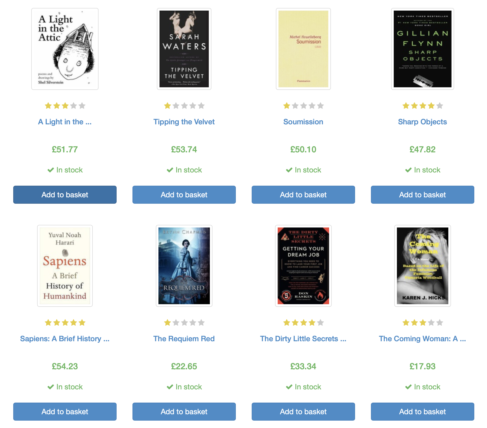
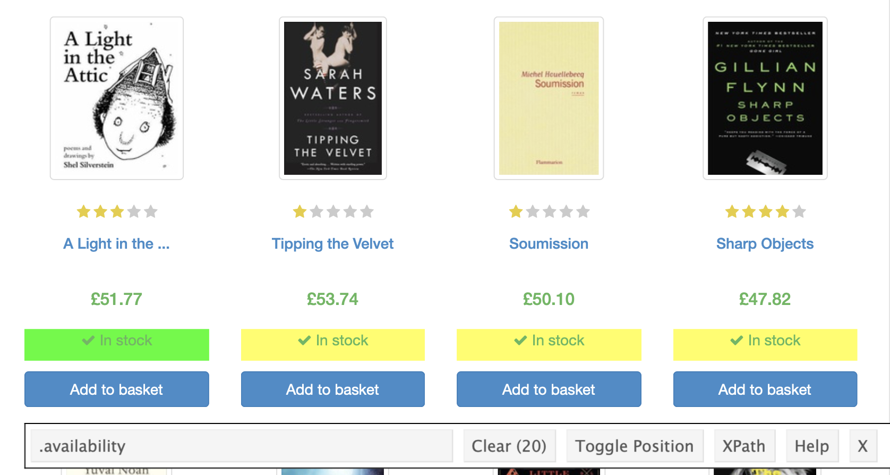
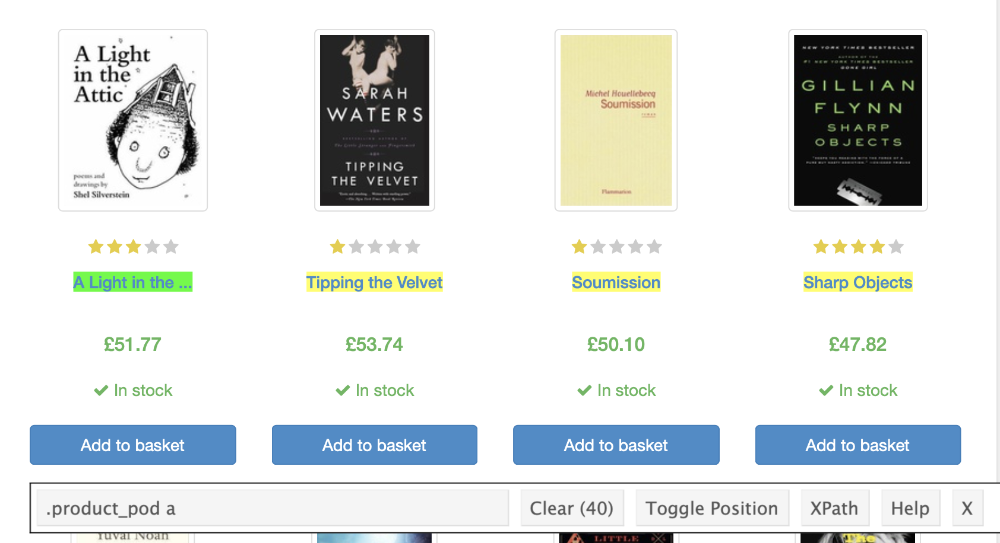

```{r setup, include=FALSE}
library(learnr)
library(knitr)
library(tidyverse)
library(rvest)
knitr::opts_chunk$set(echo = TRUE, error = TRUE, exercise.timelimit = 10)
```

## Introduction

---

### Learning objectives

- Understand HTML basics
- Use selector gadget to identify CSS selectors
- Scrape the web with `rvest` functions

---

Ideally, we would like all of our data to be in a rectangular structure 
can easily read into R. In practice, we are rarely this fortunate. 
A big part of data science is gathering and organizing the data you need. Some
analysis may require data you do not currently have but exists on the web.
Web scraping (harvesting) is the process of extracting data from websites. This
tutorial aims to give you a basic understanding of web scraping and the 
premier web scraping package available in R - `rvest`.

### Packages

The following packages have been loaded in this tutorial:

```{r}
library(tidyverse)
library(rvest)
```

## HTML

This tutorial will make use of the love-to-be-scraped website 
[Books to Scrape](http://books.toscrape.com/index.html). The goal will be to 
extract data from this website into our R environment. You'll work with a core 
set of functions and follow a standard recipe to get data such
as the title, price, and star rating of the books. First, you need to 
understand the underlying structure of a web page.

<br/>

<center>

</center>

<br/>

### Hypertext Markup Language (HTML)

HTML describes the structure of a web page; your browser interprets the 
structure and contents, and displays the results you see in Chrome, Safari,
Edge, etc.
  
The basic building blocks of HTML include elements, tags, and attributes.

  - an **element** is a component of an HTML document
  - elements contain **tags** (start and end tag)
  - **attributes** provide additional information about HTML elements

<center>

</center>

On any website you can view the page source (HTML document). For most browsers,
right click a blank part of the webpage and and select `View source` or 
`Show page source`.

### Exercise {.tabset .tabset-fade .tabset-pills}

Can you identify the attribute, its value, and the contents in the HTML
element below? This element corresponds to the price for the book
*Tipping the Velvet* as seen in the first picture.

#### HTML

```html
<p class=".price_color">£53.74</p>
```

#### Solution

| HTML component  | Value           |
|:----------------|:----------------|
| Attribute       | `class`         |
| Attribute value | `".price_color"`|
| Contents        | `£53.74`        |

<div class="info">
**Note:** The `<p>` element in HTML represents a paragraph.
</div>

### Going forward

Now that you understand the structure of a web page, you'll need functions to
read and parse these HTML documents. You may be interested in the contents 
within an HTML document, or you may be interested in the value for all `href`
attributes within the `a` tags. Functions in the package `rvest` will make it
easy to extract the components you need from the HTML document. Hence, you'll
easily be able to bring the data on the web into R.

## Package `rvest`

[`rvest`](https://github.com/tidyverse/rvest) is a package authored by Hadley 
Wickham that makes basic processing and manipulation of HTML documents easy.

Core functions:

| Function            | Description                                                       |
|:--------------------|:------------------------------------------------------------------|
| `xml2::read_html()` | read HTML from a character string or URL                          |
| `html_nodes()`      | select specified pieces from the HTML document using CSS selectors|
| `html_table()`      | parse an HTML table into a data frame                             |
| `html_text()`       | extract content                                                   |
| `html_name()`       | extract tag names                                                 |
| `html_attrs()`      | extract all attributes and values                                 |
| `html_attr()`       | extract value for a specified attribute's name                    |

### Basic workflow

1. Understand the website's hierarchy, what information you need, and where it 
   is located.

2. Read and save the HTML document as an R object by passing in the URL as a
   string to `read_html()`.

3. Subset the resulting HTML document using CSS selectors to only keep the
   relevant components.

4. Further extract attributes, text, tags, or tables with 
   `html_attr()` / `html_attrs()`, `html_text()`, `html_name()`, or 
   `html_table()`, respectively.
   
The functions have been written in such a way that you can conveniently use the
pipe operator, `%>%`, to chain together steps 2 - 4.
   
### Example

In this example, we'll obtain the prices of the books on page 1 of
[Books to Scrape](http://books.toscrape.com/index.html).

```{r books_setup, include=FALSE}
books_html <- read_html("http://books.toscrape.com/index.html")
```

**Step 2:** Read and save the HTML document as an R object by passing in the 
URL as a string to `read_html()`. We'll save this as an object named 
`books_html`.

```{r get_books_html, exercise=TRUE}
books_html <- read_html("http://books.toscrape.com/index.html")
books_html
```

At first this looks messy, but by step 4 things will look nice.

**Step 3:** Subset the HTML document to keep only the elements that contain
the prices in the content. We set `css = ".price_color"` in `html_nodes()` 
because the prices we want are inside `p` tags with a class attribute 
`price_color`. <i> The next section will explain more on how to obtain this 
`css` value for `html_nodes()`.</i>

```{r parse_books_html, exercise=TRUE}
books_html %>% 
  html_nodes(css = ".price_color")
```

**Step 4:** From the output above, we see that the prices are between the `p`
tags. That is, the prices are in the content portion of the HTML elements. The
`html_text()` function is used to extract everything between HTML tags. In this
case that would be the prices.

```{r get_prices, exercise=TRUE}
books_html %>% 
  html_nodes(css = ".price_color") %>% 
  html_text()
```

We now have all the prices. We could clean this up some more, but let's focus
on how we determine what value to pass into the `css` argument for 
`html_nodes()`.

## SelectorGadget

[SelectorGadget](https://selectorgadget.com/) makes identifying the CSS 
selector you need for `html_nodes()` easy by clicking on items on a webpage.

<br/>

<center>
<iframe title="vimeo-player" src="https://player.vimeo.com/video/52055686" width="800" height="400" frameborder="0" allowfullscreen></iframe>
</center>

<br/>

Follow the instructions at https://selectorgadget.com/ to bookmark it or
download the Chrome extension.

### Exercise 1

Go to [Books to Scrape](http://books.toscrape.com/index.html) and use
SelectorGadget to obtain the CSS selector for the prices. Verify it is the
`.price_color` value we used in the example in the last section?

### Exercise 2 {.tabset .tabset-fade .tabset-pills}

#### Task

<br/>

Identify the CSS selector for the book checkmark and "In Stock" value
using SelectorGadget.

#### Solution

<br/>

You should have found it to be `.availability` with a total of 20 identified.

<br/>

<center>

</center>

### Exercise 3 {.tabset .tabset-fade .tabset-pills}

#### Task

<br/>

Identify the CSS selector for the book titles using SelectorGadget.

#### Solution

<br/>

You should have found it to be `.product_pod a` with a total of 40 identified.
Even though only 20 title exist on the page, there are some empty values which
is why SelectorGadget identified 40 instances.

<br/>

<center>

</center>

### Exercise 4

Scrape the star rating from page 1 of 
[Books to Scrape](http://books.toscrape.com/index.html). The task has been
broken up into three steps. Fill in `---` where applicable to complete the code.

```{r ex4_step_1, exercise=TRUE}
books_html <- read_html("http://books.toscrape.com/index.html")
books_html
```

```{r ex4_step_2, exercise=TRUE}
books_html %>% 
  html_nodes(css = "---")
```

```{r ex4_step_2-solution}
books_html %>% 
  html_nodes(css = ".star-rating")
```

```{r ex4_step_3, exercise=TRUE}
books_html %>% 
  html_nodes(css = "---") %>% 
  html_attr(name = "---")
```

```{r ex4_step_3-solution}
books_html %>% 
  html_nodes(css = ".star-rating") %>% 
  html_attr(name = "class")
```

## Full example

Let's bring everything together and construct a data frame that contains
the book titles, ratings, and prices on page one of
http://books.toscrape.com/index.html.

```{r read_html, exercise=TRUE}
url <- "http://books.toscrape.com/index.html"
books_html <- read_html(url)

books_html
```

```{r scrape_data_background}
prices <- books_html %>% 
  html_nodes(css = ".price_color") %>% 
  html_text()

titles <- books_html %>% 
  html_nodes(css = ".product_pod a") %>% 
  html_attr("title") %>% 
  .[!is.na(.)]

ratings <- books_html %>% 
  html_nodes(css = ".star-rating") %>% 
  html_attr(name = "class") %>% 
  str_remove(pattern = "star-rating ")
```

```{r scrape_data, exercise=TRUE}
prices <- books_html %>% 
  html_nodes(css = ".price_color") %>% 
  html_text()

titles <- books_html %>% 
  html_nodes(css = ".product_pod a") %>% 
  html_attr("title") %>% 
  .[!is.na(.)]                            # keep non-NA values

ratings <- books_html %>% 
  html_nodes(css = ".star-rating") %>% 
  html_attr(name = "class") %>% 
  str_remove(pattern = "star-rating ")    # only keep one, two, three, four five
```

```{r build_df, exercise=TRUE, exercise.setup="scrape_data_background"}  
books_df <- tibble(
  title  = titles,
  price  = prices,
  rating = ratings
)

books_df
```

## Best practices

The following is a list of best practice guidelines for web scraping.

- Abide by a site's terms and conditions. If they ask you not to scrape, don't
  scrape.

- Respect robots.txt. Most site will have `/robots.txt` files that will specify
  what can and cannot be scraped. Take a look at a few below.

  - https://www.facebook.com/robots.txt
  
  - https://www.wegmans.com/robots.txt
  
  - https://www.google.com/robots.txt
  
  
- Cache and isolate your `read_html()` R code chunks. This way you are not
  scraping the website every time you knit your Rmd file. To cache a code chunk
  set `cache=TRUE` as a code chunk option.

- Avoid using `read_html()` in code that is iterated. This is for the same
  reason as above. It is a good idea to avoid unnecessarily scraping a website.

- Do not violate any copyright laws with the information you scrape.

## Additional resources

Want to learn more about web scraping? Check out some of the following 
resources.

1. `rvest` [vignette](http://rvest.tidyverse.org)

2. Learn more about CSS with [CSS Diner](https://flukeout.github.io)

## References

1. Easily Harvest (Scrape) Web Pages. (2020). Rvest.tidyverse.org. 
   Retrieved from https://rvest.tidyverse.org/.
   
2. SelectorGadget: point and click CSS selectors. (2020). Selectorgadget.com. 
   Retrieved from https://selectorgadget.com/.