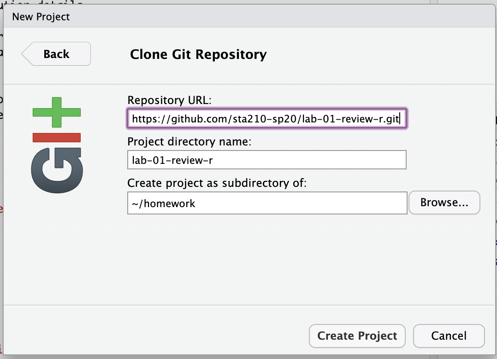

```{r setup, include=FALSE}
knitr::opts_chunk$set(echo = TRUE)
```

## Clone the repo & start new RStudio project

- Go to the sta210-sp20 organization on GitHub (http://www.github.com/sta210-sp20). Click on the repo with the prefix **lab-01-review-r-**. It contains the starter documents you need to complete the lab.

```{r clone-repo-link, fig.margin = TRUE, echo = FALSE, fig.width=3}
knitr::include_graphics("clone-new-project-img/clone-repo-link.png")
```

- Click on the green **Clone or download** button, select **Use HTTPS** (this might already be selected by default, and if it is, you'll see the text **Clone with HTTPS** as in the image below). Click on the clipboard icon to copy the repo URL.

```{r new-project-from-gh, fig.margin = TRUE, echo = FALSE, fig.width=3, eval = F}
knitr::include_graphics("clone-new-project-img/new-project-from-gh.png")
```

- Go to https://vm-manage.oit.duke.edu/containers and login with your Duke NetId and Password.

- Click to log into the Docker container **STA 210 - Regression Analysis**. You should now see the RStudio environment. 

```{r paste-gh-repo-url, fig.margin = TRUE, echo = FALSE, fig.width=5}

```

- Go to *File* `r emo::ji("arrow_right")` *New Project* `r emo::ji("arrow_right")` *Version Control* `r emo::ji("arrow_right")` *Git*. 

- Copy and paste the URL of your assignment repo into the dialog box *Repository URL*. You can leave *Project Directory Name* empty. It will default to the name of the GitHub repo.


- Click *Create Project*, and the files from your GitHub repo will be displayed the *Files* pane in RStudio. 

## Configure git 

There is one more piece of housekeeping we need to take care of before we get started. Specifically,  we need to configure your git so that RStudio can communicate with GitHub. This requires two pieces of information: your name and email address.

To do so, you will use the `use_git_config()` function from the `usethis` package. 

Type the following lines of code in the **console** in RStudio filling in your name and email address.

```{marginfigure}
The email address is the one tied to your GitHub account. 
```

```{r eval=FALSE}
library(usethis)
use_git_config(user.name = "GitHub username", user.email="your email")
```

For example, mine would be 

```{r eval=FALSE}
library(usethis)
use_git_config(user.name="matackett", user.email="maria.tackett@duke.edu")
```

If you get the error message

```{r eval=FALSE}
Error in library(usethis) : there is no package called ‘usethis’
```

then you need to install the `usethis` package. Run the following code in the console to install the package. Then, rerun the `use_git_config` function with your GitHub username and email address associated with your GitHub account.

```{r eval=FALSE}
install.package("usethis")
```

Once you run the configuration code, your values for `user.name` and `user.email` will display in the console. If your `user.name` and `user.email` are correct, you're good to go! Otherwise, run the code again with the necessary changes.