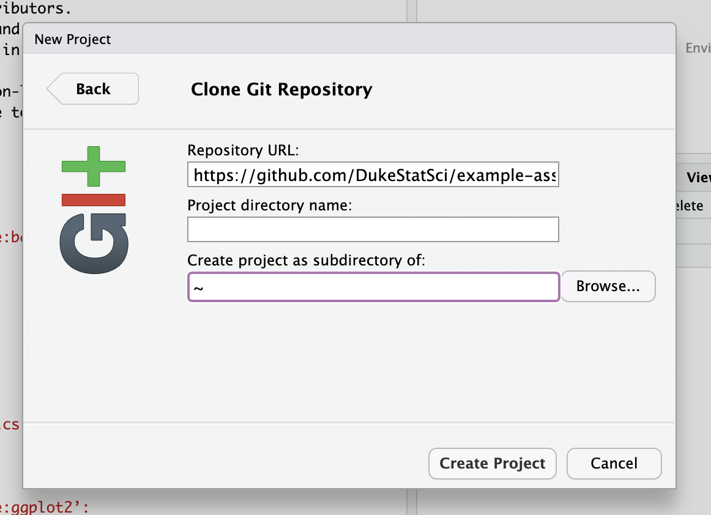

```{r setup, include=FALSE}
knitr::opts_chunk$set(echo = FALSE, 
                      warning = FALSE, 
                      message = FALSE, 
                      fig.align = "center")
```

[GitHub.com](www.github.com) is an online platform that is commonly used in industry and academia for collaboration. You will use GitHub in your statistics / data science class to complete individual and team assignments. This is the first of two tutorials to walk you through the steps you will need to successfully use GitHub in your classes. 

By the end of this tutorial, you will be able to 

- Understand commonly used GitHub terms
- Clone a GitHub repo
- Start a new project in an RStudio docker container
- Connect the RStudio project to your GitHub repo


## Terminology

Below are terms that are commonly used when talking about GitHub.^[Definitions from Beckman, M., C¸ etinkaya-Rundel M., Horton, N., Rundel, C., Sullivan, A., Tackett, M. *Implementing version control with Git as a learning objective in statistics courses.* [arxiv.org/abs/2001.01988](https://arxiv.org/abs/2001.01988).] 

| Term   | Definition |
|--------|------------|
| Git    | An open source version control software system |
| GitHub | A remote commercial hosting service for Git repositories       |
| Git repository (or repo) | Similar to a project directory or folder in Google Drive, Dropbox, etc. It tracks changes to files.         |
| commit | Save changes to a local repo        |
| pull | Update a local repo        |
| push | Upload local files to the remote repo        |
| merge conflict | Contradictory changes that cannot be integrated until they are reconciled by a user       |

<br>

As you begin to use GitHub more, you may also come across terms describing more advanced GitHub actions.

| Term   | Definition |
|--------|------------|
| forking   | Create a copy of a repository in your local profile |
| pull request | Submit changes to a remote repo       |
| branching | Keeping multiple snapshot of a repo |
| gh-pages | Special branch which allows creation of a webpage from within GitHub        |
| GitHub actions | Mechanism for continuous integration |


## Clone a GitHub repo

Most of your assignments will be done using GitHub and RStudio. You'll begin with a starter repo on GitHub (mostly likely provided by your instructor) that contains templates and other materials needed to complete the assignment. You'll conduct your analysis and type your responses in RStudio and "push" the updates back to the repo on GitHub. In this tutorial, we will focus on the steps to get started on an assignment - specifically cloning a repo and starting a new project in RStudio.

We'll use the [example-assignment repo](https://github.com/DukeStatSci/example-assignment) in the [DukeStatSci GitHub organization](https://github.com/DukeStatSci) on for this tutorial. You can use this repo to practice the steps in this tutorial; however, note that you **<u>cannot</u>** push to the repo (we'll talk more about pushing in the next tutorial). 

## Clone a repo + create new project

1. Go to your course organization on GitHub. The URL for the course organization is provided by your instructor. In this tutorial, the organization is DukeStatSci at [www.github.com/DukeStatSci](https://github.com/DukeStatSci).

2. Click on the relevant assignment repo. Ours is the [example-assignment](https://github.com/DukeStatSci/example-assignment) repo. This contains the starter documents and other materials required for the assignment. 

```{r clone-repo, fig.width=3}
knitr::include_graphics("clone-new-project-img/starter-repo.png")
```

3. Click on the green **Code** button and make sure it says "Clone with HTTPS" (this is the default option). Click on the clipboard icon to copy the repo URL.

```{r clone-repo-link, fig.width=3}
knitr::include_graphics("clone-new-project-img/clone-repo.png")
```

4. Go to the Docker containers at https://vm-manage.oit.duke.edu/containers and log in with your Duke NetId and Password.

5. Click to log into the Docker container for your course. You should now see the RStudio environment.

6. Go to *File* `r emo::ji("arrow_right")` *New Project* `r emo::ji("arrow_right")` *Version Control* `r emo::ji("arrow_right")` *Git*. 

7. Copy and paste the URL of your assignment repo into the dialog box *Repository URL*. You can leave *Project directory name* empty. It will default to the name of the GitHub repo.

```{r new-project-from-gh,out.width = "60%"}

```

8. Click *Create Project*, and the files from your GitHub repo will be displayed the *Files* pane in RStudio. 

```{r create-project, fig.width=3}
knitr::include_graphics("clone-new-project-img/create-project.png")
```


## Configure git 

There is one thing to take care of before you start completing the assignment. You need to configure git so that RStudio can communicate with GitHub. To do so, you will use the `use_git_config()` function from the `usethis` package. 

Type the following lines of code in the **console** in RStudio filling in your GitHub username and the email address tied to your GitHub account.


```{r echo = T, eval=FALSE}
library(usethis)
use_git_config(user.name = "your GitHub username", user.email="your email")
```

If you get the error message

```{r echo = T, eval=FALSE}
Error in library(usethis) : there is no package called ‘usethis’
```

then you need to install the `usethis` package by running the code below in the console: 


```{r echo = T, eval=FALSE}
install.package("usethis")
library(usethis)
```

Then, rerun the `use_git_config` function with your GitHub username and email address.

<br>

**That's it! You've cloned a repo, started a new project in RStudio, and configured git. You're now ready to start your analysis in RStudio!**
