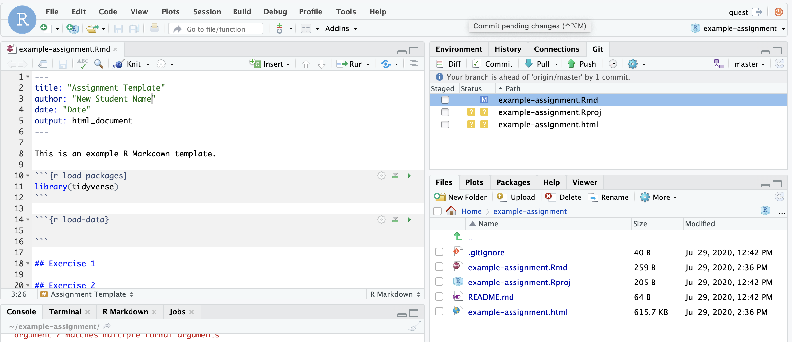
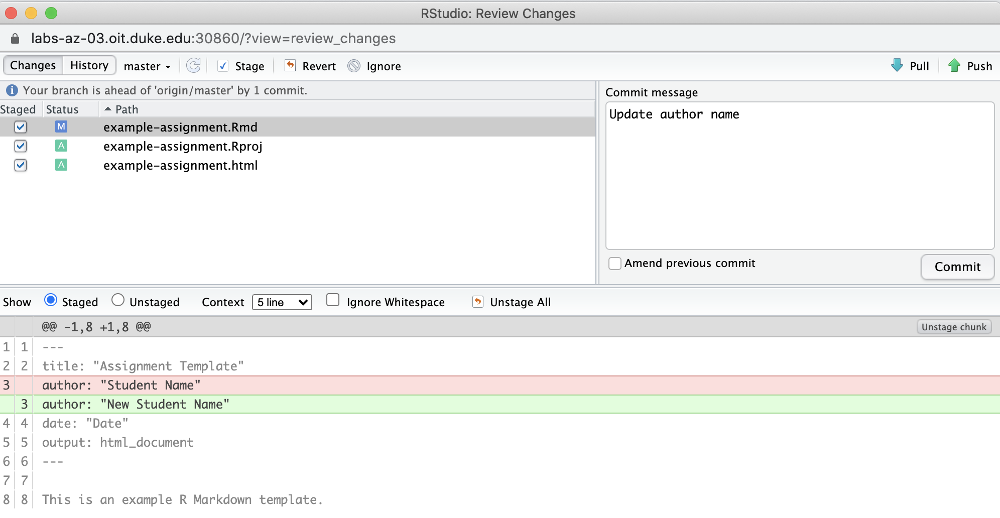
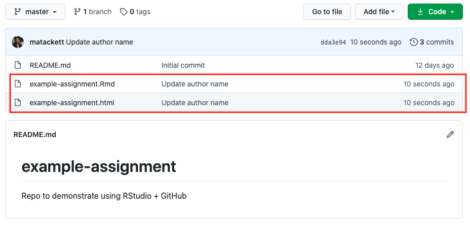

```{r setup, include=FALSE}
knitr::opts_chunk$set(echo = FALSE, 
                      warning = FALSE, 
                      message = FALSE, 
                      fig.align = "center")
```

In the tutorial [Getting Started with GitHub: Clone Repo + Start New RStudio Project](clone-new-project.html), you learned how to clone a repo and start a new project in RStudio. In this tutorial, we'll talk about how to pass updated files between RStudio and GitHub as you work on your analysis. 

By the end of this tutorial, you will be able to 

- Commit a change
- Push changes from RStudio to GitHub
- Pull changes from GitHub to RStudio


## Terms

Below are terms that are commonly used to describe the set up and actions when using GitHub.^[Definitions from Beckman, M., &Ccedil;etinkaya-Rundel, M., Horton, N., Rundel, C., Sullivan, A.,& Tackett, M. *Implementing version control with Git as a learning objective in statistics courses.* [arxiv.org/abs/2001.01988](https://arxiv.org/abs/2001.01988).] 

| Term   | Definition |
|--------|------------|
| Git    | An open source version control software system |
| GitHub | A remote commercial hosting service for Git repositories       |
| Git repository (or repo) | Similar to a project directory or folder in Google Drive, Dropbox, etc. It tracks changes to files.         |
| commit | Save changes to a local repo        |
| pull | Update a local repo        |
| push | Upload local files to the remote repo        |
| merge conflict | Contradictory changes that cannot be integrated until they are reconciled by a user       |

<br>

As you begin to use GitHub more, you may also come across terms describing more advanced GitHub actions.

| Term   | Definition |
|--------|------------|
| forking   | Create a copy of a repository in your local profile |
| pull request | Submit changes to a remote repo       |
| branching | Keeping multiple snapshots of a repo |
| gh-pages | Special branch which allows creation of a webpage from within GitHub        |
| GitHub actions | Mechanism for continuous integration |

## Commit + Push

As you work on your analysis, you should periodically *knit, commit, and push*. When you knit your document, you render a new HTML (.html), PDF (.pdf), or Markdown (.md) document that includes your analysis updates. Then, you will commit the changes and push them to the remote assignment repo on GitHub. 

### Commit 

We'll go back to the [example-assignment repo](https://github.com/DukeStatSci/example-assignment) from the previous tutorial. Let's suppose the author name is updated in the YAML. The RMarkdown file is then knit to render an updated HTML. 


The next thing we want to do is **commit** the changes to save them. To commit the changes: 

1. Click on the *Git* pane in RStudio. 


```{r}

```

2. Check the boxes next to **<u>every</u>** file listed in the *Git* pane.

3. Click the *Commit* button, and a new box will pop up.

4. If you highlight the .Rmd file, you can see the changes that were made. Here we see that the author name was changed from "Student Name" to "New Student Name".


```{r}

```

5. If you're happy the changes, write an informative commit message in the Commit message box. The commit message is a brief description of the changes that were made. In this case we will write the message "Update author name". 

6. Click *Commit*.

You don't have to commit after every change, as this would get quite cumbersome. You should consider committing states that are *meaningful to you* for inspection, comparison, or restoration. When working on an assignment, it is good practice to commit after completing a few exercises. 

### Push

Now that you have made an update and committed this change, it's time to **push** these changes to the web. Or more specifically, to your repo on GitHub. Why? So that others can see your changes. In the context of class, we mean the teaching team. (Your repos in this course are private and can only be seen by you and the teaching team.)

To push your changes to GitHub, click *Push* in the Commit message box from earlier.

Make sure you push all the files from the *Git* pane to your assignment repo on GitHub. In other words, the Git pane should be empty after you push. If it's not empty, click the box next to the remaining files, write an informative commit message, and push.

You can now go to your repo on GitHub and see the updates!

```{r}

```

## Pull 

Sometimes there are updates to documents in your repo on GitHub that aren't in your local RStudio repo. This is most often the case when you are collaborating on an team analysis / assignment and a teammate pushes the work they've done to the team's GitHub repo. 

To update the local repo, click the **Pull** button in the Git pane. You will now see the updates reflected in your RStudio environment.

**Tip: When you're with multiple people in a single GitHub repo, you should always <i>pull</i> before adding new work. This will ensure you are starting with the most up-to-date version of the team's analysis, and it will help you avoid merge conflicts.**

<br> 

## Acknowledgements

The instructions from this tutorial were adapted from labs in [Data Science in a Box](https://datasciencebox.org/) by Mine &Ccedil;etinkaya-Rundel.
