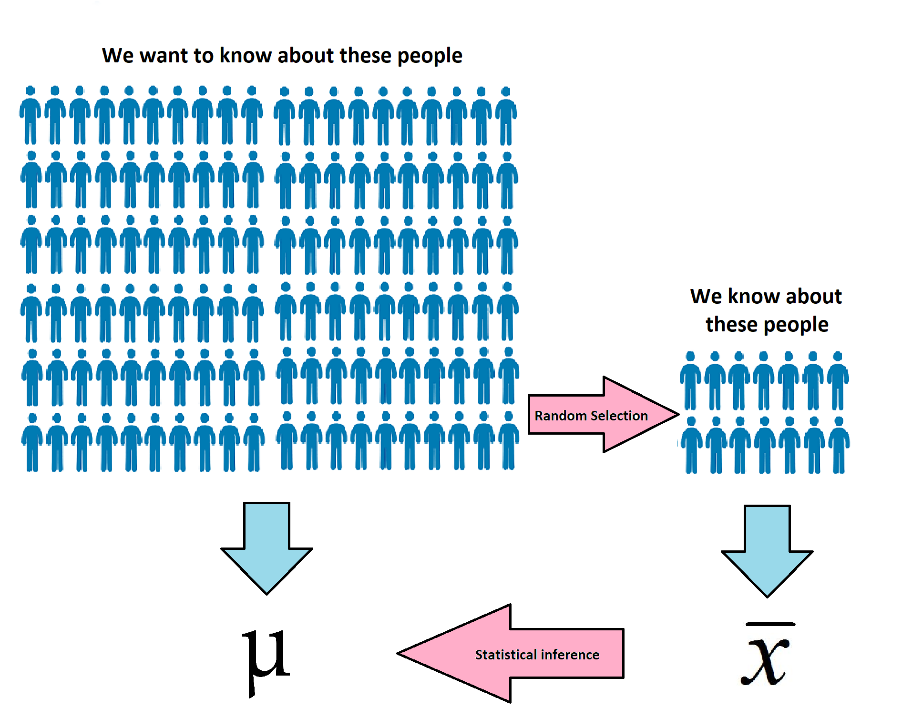

```{r setup, include=FALSE}
knitr::opts_chunk$set(echo = TRUE, 
                      warning = FALSE, 
                      message = FALSE,
                      exercise.timelimit = 3)
```


```{r, include=FALSE}
library(learnr)
library(knitr)
```

## Introduction

---

This tutorial will introduce you to the basics of bootstrapping, and how to
bootstrap in R using the infer package.  Load the packages below before 
starting this tutorial.

```{r}
library(infer)
library(tidyverse)
```

Before we begin, let's review some statistical inference 
terminology.

### Statistical Inference

**Statistical inference** refers to the process of generalizing 
from a sample to a population. The **population** is some collection of objects
of interest and the **parameter** is an unknown number derived from the 
population. The **sample** is a subset of the population and the **statistic** 
is a number calculated from the sample.

<center>

</center>

We can use a single number called a point estimate as our best guess of the 
population parameter, but we often prefer a range of plausible values. This 
is called an interval estimate. A point estimate is not likely to exactly
hit the population parameter, while a range of plausible parameters has a
pretty good chance of capturing it. We will work with a type of interval 
estimate called a confidence interval.

## The Bootstrap Idea

To construct a confidence interval we need to quantify the variability of 
our sample statistic. We can do this using the Central Limit Theorem but
today we will focus on a simulation-based resampling method called the 
bootstrap.

In general, bootstrap methods

- have fewer requirements than other (CLT-based) methods
- give more accurate answers
- are more flexible and easily applied to new settings

The basic idea of the bootstrap is as follows: our sample is representative of 
the population we drew from, so if we resample from our original sample many 
times, this is representative of what we would obtain if we took many samples 
from the population.

To bootstrap we follow the steps outlined below:

1. Take a random sample with replacement from our original sample using the 
same sample size as our original sample. This is the bootstrap sample.
2. Calculate the bootstrap statistic for this sample. This is a statistic such
as the median, mean, proportion, slope, etc.
3. Repeat (1) and (2) many times using a computer to create a bootstrap 
distribution. This is the distribution of bootstrap statistics.
4. Calculate a confidence interval using your bootstrap distribution.

(add small toy example here?)

## Bootstrapping with Infer

The `mtcars` data set contains attributes of 32 cars. We will consider these 
32 cars to be a random sample from a population of interest. Suppose we want to construct an interval estimate for the true median mpg. 

Remember, to learn more about the data set and variables, type the following 
code into the console:

```{r}
?mtcars
```

First examine a histogram of miles per gallon. 

```{r}
ggplot(data = mtcars, aes(x = mpg)) + 
  geom_histogram() +
  labs(x = "Miles Per Gallon")
```

We will use the infer package to construct a bootstrap confidence interval for
the median mpg.

<center>

</center>

To generate the bootstrap distribution:

1. `specify()` the variable of interest.
2. `generate()` the bootstrap samples.
3. `calculate()` the bootstrap statistics.

We do this in the code chunk below using the `set.seed()` function to control
the random number generator in R. This makes our simulation reproducible.

```{r}
set.seed(42)
boot_dist <- mtcars %>%
  specify(response = mpg) %>%
  generate(reps = 10000, type = "bootstrap") %>%
  calculate(stat = "median")
```


```{r quiz2, echo=FALSE}
quiz(
  question("How many observations are in boot_dist?",
    answer("10000", 
           correct = TRUE,
           message = "Correct"),
    answer("32", 
           message = "Incorrect"),
    answer("42", 
           message = "Incorrect"),

    random_answer_order = TRUE
  ),
  
  question("What does each row in boot_dist represent?",
    answer("Incorrect Answer"), 
    answer("Another Incorrect Answer"),
    answer("Correct Answer",
           correct = TRUE),
    answer("Yet Another Incorrect Answer"),
    answer("Final Incorrect Answer"),
    random_answer_order = TRUE,
    allow_retry = TRUE
  )
)
```

Let's visualize the bootstrap distribution.

```{r}
ggplot(data = boot_dist, aes(x = stat)) + 
  geom_histogram() +
  labs(x = "Median MPG")
```

To construct a 95\% bootstrap confidence interval, just find the middle 95\% of
the bootstrap distribution. We can do the same procedure for any desired level 
of confidence.

```{r}
boot_dist %>%
  summarize(lower_bound = quantile(stat, 0.025),
            upper_bound = quantile(stat, 0.975))
```

Or using the infer package.

```{r}
get_ci(boot_dist, level  = 0.95)
```

Finally, let's visualize the confidence interval on the bootstrap distribution.

```{r, echo = FALSE}
lower_bound <- boot_dist %>% 
  summarize(lower_bound = quantile(stat, 0.025)) %>% pull()
upper_bound <- boot_dist %>% 
  summarize(upper_bound = quantile(stat, 0.975)) %>% pull()

ggplot(data = boot_dist, aes(x = stat)) + 
  geom_histogram() + 
  geom_vline(xintercept = c(lower_bound, upper_bound), linetype = "dotted")
```

We are 95\% confident that the median mpg of all cars in the population is 
between `r lower_bound` and `r upper_bound`.

## Practice!

Need to add..

Have students

1. Read in data
2. Summarize data
3. Construct a X% confidence interval using infer (interesting statistic)
4. Interpret in context.

## Resources

Need to add.
